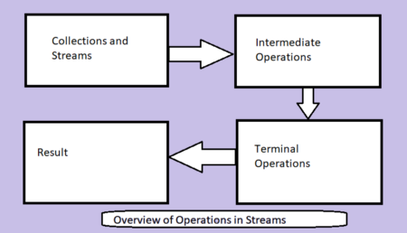
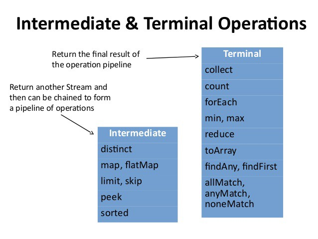
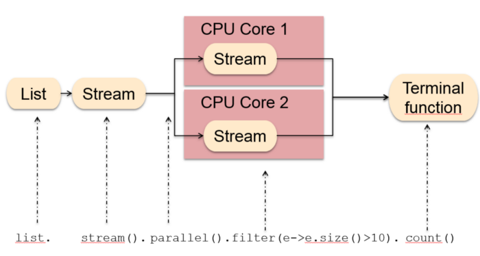
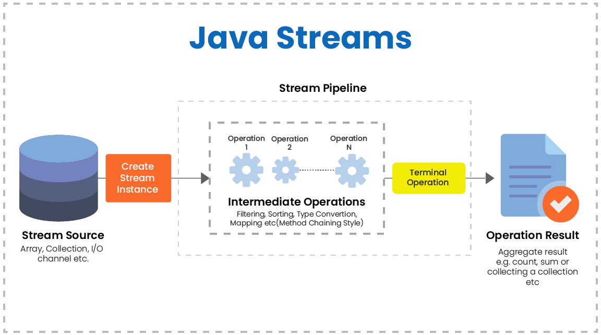
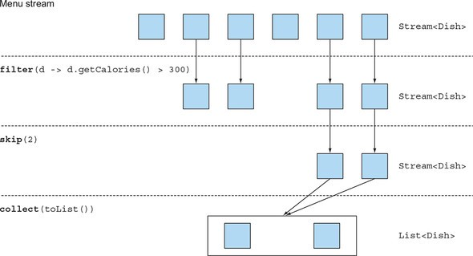
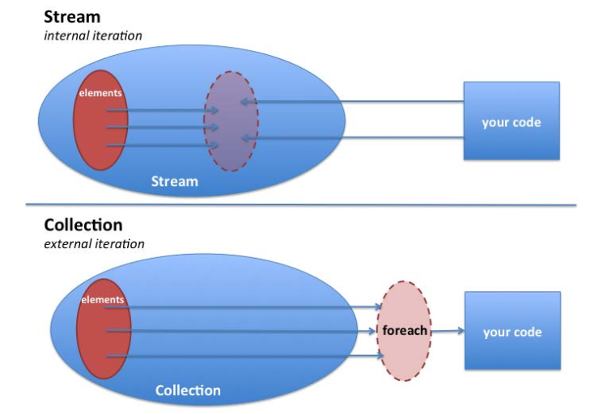
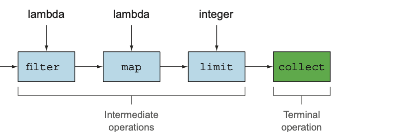

**Stream vs Collection**
-   Collection: 컬렉션은 모든 값을 보유하는 메모리 내 데이터 구조.
-   Stream: Elements 는 필요에 따라 계산.

**External vs Internal Iteration**

-   컬렉션 인터페이스는 사용자가 반복 `external iteration`
-   스트림 라이브러리는 알아서 반복을 수행 `internal iteration`

내부 반복의 이점

-   라이브러리에는 병렬 처리 기능이 있다.
-   처리 알고리즘을 최적화한다.

**Stream Operations**

스트림에는 두 가지 작업 그룹이 있다:

-  중간 작업 : 파이프라인을 형성하기 위해 함께 연결다. 예)  filter, map, limit.
-  터미널 작업 : 실행 후 파이프라인을 실행하고 닫는다. 예) collect

중간 작업은 Lazy 하다.
터미널 작업이 스트림 파이프라인에서 호출될 때까지는 처리를 수행하지 않는다.

